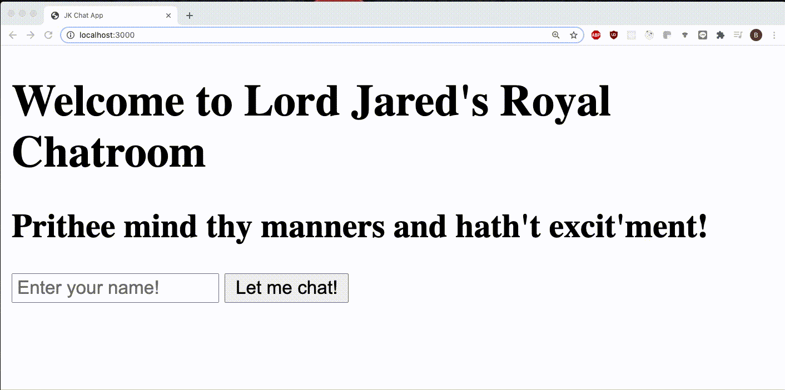

# chatApp1 - JK - Socket.io

## Description

A MVP chat room application built to test using Socket.io! 

## Getting Started

Git clone the following URL to a folder: https://github.com/bbyee/chatApp1-JK-Socket

### Prerequisites

Requires git to retrieve the packages.

### Installing

Once the file has been cloned to a local folder, cd into the folder and run

- `npm install`

- `npm install express` 

- run `nodemon app.js`

- View the application on localhost:3000 (Opening multiple windows on localhost:3000 will simulate multiple clients accessing the chat room)

## Deployment

Not currently deployed.

## Built With

- Socket.io

## Authors

- **Brittany Yee**
